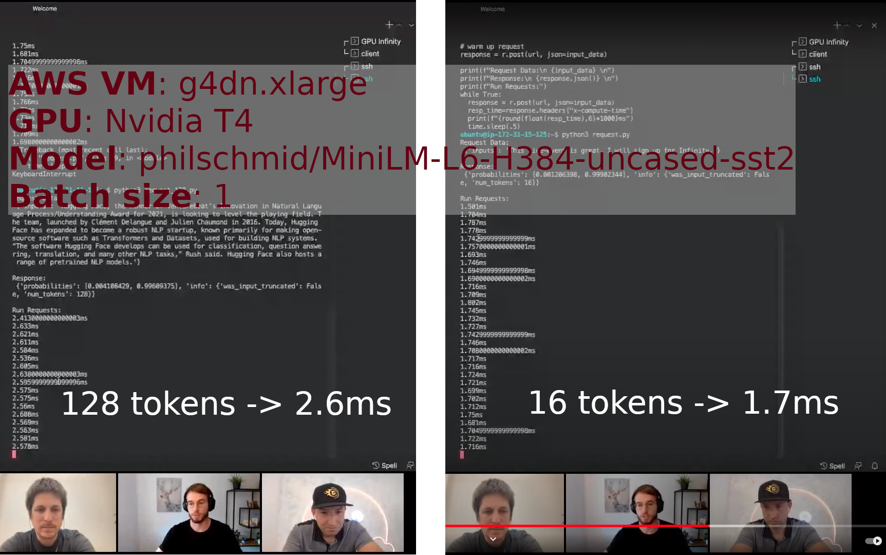

# from 🤗 to 🤯 : Hugging Face Transformer submillisecond inference and deployment to production

*Optimize and deploy in **production** Hugging Face Transformer models in a single command line.*  

**Table Of Contents**

* [benchmarks](#benchmarks) (GPU: T4, 3090 RTX)
* [run in Docker](#docker-build) (simple)
* [end to end reproduction of Infinity Hugging Face demo benchmark](#infinity-hugging-face-demo-benchmark)
* [build from sources](#build-from-sources) (complete)

> Want to understand how it work under the hood?  
> => check [Hugging Face Transformer inference UNDER 1 millisecond latency](https://towardsdatascience.com/hugging-face-transformer-inference-under-1-millisecond-latency-e1be0057a51c?source=friends_link&sk=cd880e05c501c7880f2b9454830b8915)

The tool optimize your model with Microsoft [ONNX Runtime](https://github.com/microsoft/onnxruntime/) or Nvidia [TensorRT](https://github.com/NVIDIA/TensorRT/).  
Then it will generate all templates to launch Nvidia [Triton inference server](https://github.com/triton-inference-server/server).  

## Benchmarks

TODO complete

* GPU T4
* GPU 3090 RTX

## Docker build

```shell
# install Python dependencies inside the docker image
docker build --tag transformer_deploy:latest -f Dockerfile .
```

## Infinity Hugging Face demo benchmark

### Infinity demo information

Hugging Face has announced a commercial product called Infinity to perform enterprise scale inference solution.  
More information available [here](https://huggingface.co/infinity).

There are very few information about its performances outside this video: [demo video (Youtube)](https://www.youtube.com/watch?v=jiftCAhOYQA)

Setup they used for their demo:

* AWS virtual machine: `g4dn.xlarge` (T4 GPU)
* model: `"philschmid/MiniLM-L6-H384-uncased-sst2"` (Hugging Face hub URL)
* experience 1 : batch size 1, seq len 16 tokens -> `1.7ms`/query
* experience 2 : batch size 1, seq len 128 tokens -> `2.5ms`/query



### Model optimization

Let's optimize `philschmid/MiniLM-L6-H384-uncased-sst2` model from the Hugging Face hub (inside the docker image):

```shell
docker run -it --rm --gpus all -v $PWD:/project transformer_deploy:latest \
  bash -c "cd /project && convert_model -m \"philschmid/MiniLM-L6-H384-uncased-sst2\" \
  --name sts --backend tensorrt onnx pytorch --verbose --seq-len 16 128 128"
```

It should produce something like that:

# TODO update scores with T4

```log
inference done on NVIDIA GeForce RTX 3090
[TensorRT (FP16)] mean=0.44ms, sd=0.07ms, min=0.41ms, max=2.27ms, median=0.43ms, 95p=0.48ms, 99p=0.66ms
[ONNX Runtime (vanilla)] mean=1.55ms, sd=0.68ms, min=1.12ms, max=4.40ms, median=1.21ms, 95p=3.06ms, 99p=4.00ms
[ONNX Runtime (optimized)] mean=1.22ms, sd=0.73ms, min=0.76ms, max=4.58ms, median=0.83ms, 95p=2.84ms, 99p=3.58ms
[Pytorch (FP32)] mean=5.36ms, sd=0.52ms, min=4.96ms, max=9.12ms, median=5.18ms, 95p=6.65ms, 99p=7.38ms
[Pytorch (FP16)] mean=5.92ms, sd=0.45ms, min=5.49ms, max=9.76ms, median=5.77ms, 95p=6.73ms, 99p=7.61ms
```

`TensorRT` and optimized `ONNX Runtime` provides similar results on short sequences.
In the following steps, we will continue with ONNX Runtime model because the dynamic axis are easier to work with compared to TensorRT. 

### Launch Nvidia Triton inference server

> ⚠️**WARNING**⚠️: if you ran the model conversion *outside* Docker container, check that your TensorRT version is the same than the Triton backend one. 

Launch `Nvidia Triton inference server`: 

```shell
# install transformers (and its tokenizer) and launch server in a single line, ugly but good enough for our demo
# --shm-size 256m -> to have up to 4 Python backends (tokenizer) at the same time 
docker run -it --rm --gpus all -p8000:8000 -p8001:8001 -p8002:8002 --shm-size 256m \
  -v $PWD/triton_models:/models nvcr.io/nvidia/tritonserver:21.10-py3 \
  bash -c "pip install transformers && tritonserver --model-repository=/models"
```

> As you can see we install Transformers and then launch the server itself.
> This is of course a bad practice, you should make your own 2 lines Dockerfile with Transformers inside.

### Performance analysis

Measures:

* 16 tokens + TensorRT:
```shell
ubuntu@ip-172-31-31-84:~/triton_transformers$ python3 triton_transformers.py --length 16 --model tensorrt
10/31/2021 12:09:34 INFO     timing [triton transformers]: mean=1.53ms, sd=0.06ms, min=1.48ms, max=1.78ms, median=1.51ms, 95p=1.66ms, 99p=1.74ms
[[-3.4355469  3.2753906]]
```

* 128 tokens + TensorRT:
```shell
ubuntu@ip-XXX:~/triton_transformers$ python3 triton_transformers.py --length 128 --model tensorrt
10/31/2021 12:12:00 INFO     timing [triton transformers]: mean=1.96ms, sd=0.08ms, min=1.88ms, max=2.24ms, median=1.93ms, 95p=2.17ms, 99p=2.23ms
[[-3.4589844  3.3027344]]
```

There is also a more serious performance analysis tool called perf_analyzer (it will take care to check that measures are stable, etc.).
[documentation](https://github.com/triton-inference-server/server/blob/main/docs/perf_analyzer.md)
The tool need to be run on Ubuntu >= 20.04 (and won't work on Ubuntu 18.04 used for the AWS official Ubuntu deep learning image):

```shell
# perf_analyzer needs this dependency
sudo apt install libb64-dev
# add -a for async measures, and -i grpc to use that protocol instead of http 
~/.local/bin/perf_analyzer -m sts_tensorrt_inference --percentile=95 --string-data "This live event is great. I will sign-up for Infinity." --shape TEXT:1 -i grpc -a

# just test the model part (easier to get random input)
~/.local/bin/perf_analyzer --input-data zero -m sts_tensorrt_model --shape input_ids:8,384 --shape attention_mask:8,384 --concurrency-range 1:4 -i grpc -a -f perf.csv
~/.local/bin/perf_analyzer -m sts_tensorrt_inference --percentile=95 --string-data "This live event is great. I will sign-up for Infinity." --shape TEXT:1 -i grpc -a --concurrency-range 1:4 -f perf.csv
```

### FastAPI server baseline

This is our baseline, easy to run, but not very performant.

```shell
# launch server, disable logging for best performances
python3 -m uvicorn --log-level warning server_onnx:app --port 8000 --host 0.0.0.0
# other variation, 1 worker per CPU for best latency (plus not a good idea to have several times the same model on a single GPU):
python3 -m gunicorn -w 1 -k uvicorn.workers.UvicornWorker --log-level warning server_onnx:app --bind 0.0.0.0:8000

# simple inference timing
time curl -G --data-urlencode query="This live event is great. I will sign-up for Infinity." localhost:8000/predict
# slightly more serious measure
sudo apt-get install linux-tools-common linux-tools-generic linux-tools-`uname -r`
sudo perf stat -r 50 -d curl -G --data-urlencode query="This live event is great. I will sign-up for Infinity." localhost:8000/predict -s > /dev/null
```

It should produce:

```shell
Performance counter stats for 'curl -G --data-urlencode query=This live event is great. I will sign-up for Infinity. localhost:8000/predict' (50 runs):

              6.14 msec task-clock                #    0.494 CPUs utilized            ( +-  0.59% )
                 3      context-switches          #    0.462 K/sec                    ( +-  1.84% )
                 0      cpu-migrations            #    0.000 K/sec                  
               577      page-faults               #    0.094 M/sec                    ( +-  0.06% )
   <not supported>      cycles                                                      
   <not supported>      instructions                                                
   <not supported>      branches                                                    
   <not supported>      branch-misses                                               
   <not supported>      L1-dcache-loads                                             
   <not supported>      L1-dcache-load-misses                                       
   <not supported>      LLC-loads                                                   
   <not supported>      LLC-load-misses                                             

         0.0124429 +- 0.0000547 seconds time elapsed  ( +-  0.44% )
```

## Build from sources

```shell
git clone git@github.com:ELS-RD/triton_transformers.git
cd triton_transformers
pip3 install . -f https://download.pytorch.org/whl/cu113/torch_stable.html
```

## Prerequisites

There are 2 ways to run this package:

* *simple method*: inside a `Docker` container (dependencies are managed for you)
* without container, you need to check you have installed all dependencies


### Required dependencies

To run this package locally, you need:

**TensorRT GA build**
* [TensorRT](https://developer.nvidia.com/nvidia-tensorrt-download) v8.2.0.6

**System Packages**
* [CUDA](https://developer.nvidia.com/cuda-toolkit)
  * Recommended versions:
  * cuda-11.4.x + cuDNN-8.2
  * cuda-10.2 + cuDNN-8.2
* [GNU make](https://ftp.gnu.org/gnu/make/) >= v4.1
* [cmake](https://github.com/Kitware/CMake/releases) >= v3.13
* [python](<https://www.python.org/downloads/>) >= v3.6.9
* [pip](https://pypi.org/project/pip/#history) >= v19.0


By running this package inside docker we guarantee all dependencies are installed as expected.  
First we build the image:

```shell

```

## model analyzer

```shell
# inside triton docker image

docker run -it --rm --gpus all -v $PWD:/project fast_transformer:latest bash
model-analyzer profile -f /project/config_analyzer.yaml
```

## Call Triton HTTP API directly

If you don't want to use the `tritonclient` API, you can call the Triton server those ways:

```shell
# if you like Python requests library
python3 triton_requests.py

# if you want generic HTTP template, the @ means no data conversion
curl -X POST  http://localhost:8000/v2/models/transformers/versions/1/infer \
  --data-binary "@query_body.bin" \
  --header "Inference-Header-Content-Length: 160"
```
