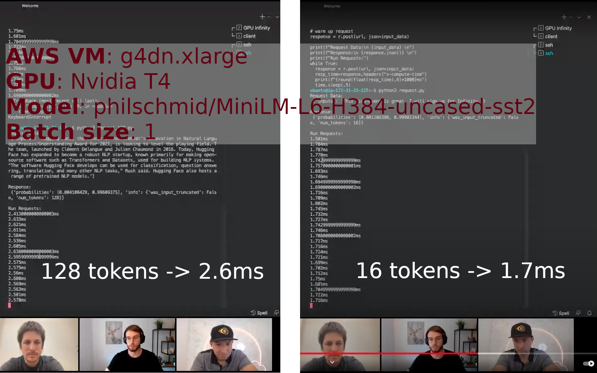

# Infinity Baseline

In the demo, 4 measures are performed on the same model, 2 on GPU and 2 on CPU:

| AWS instance |    GPU    | model                                  | seq len | batch size | latency |
|:-------------|:---------:|:---------------------------------------|:--------|:-----------|:--------|
| g4dn x.large | Nvidia T4 | philschmid/MiniLM-L6-H384-uncased-sst2 | 16      | 1          | 1.7ms   |
| g4dn x.large | Nvidia T4 | philschmid/MiniLM-L6-H384-uncased-sst2 | 128     | 1          | 2.6ms   |

The purpose of this tutorial is to explain how to heavily optimize a Transformer from Hugging Face and deploy it on a production-ready inference server, end to end.   

The performance improvement brought by this process applies to all scenarios, from short sequences to long ones, from a batch of size 1 to large batches. When the architecture is compliant with the expectations of the tools, the process always brings a significant performance boost compared to vanilla PyTorch.

The process is in 3 steps:

* convert Pytorch model to a graph
* optimize the graph
* deploy the graph on a performant inference server

At the end we will compare the performance of our inference server to the numbers shown by :hugging: Hugging Face during the demo and will see that we are faster for both 16 and 128 tokens input sequences with batch size 1 (as far as I know, :hugging: Hugging Face has not publicly shared information on other scenarios).

